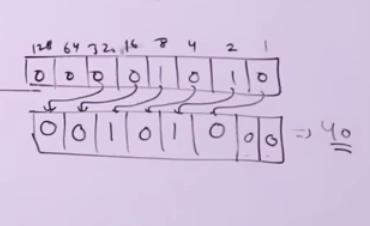
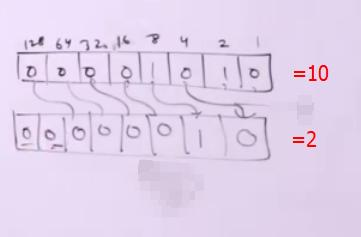

# C Program Documention inspire by Jenny Lecture

</br>

> ## Structure of C Program

</br>

1.Documention Section

```
//Single Line Comment

/*Multiple
Line
Comment*/
```

2.Link Section

```
#include<stdio.h>
#include<conio.h>
```

3.Definition Section

```
#Define MAX 500
```

4.Global Declaration Section

```
int a=40;
void funk();
```

5.Main Section

```
int main(){
    printf("Hello");
}
```

6.Sub Program Section

</br></br>

> ## Constant in C

1.Numeric Constant

- Integer Constant

  1.  Decimal

  ```jsx
  0-9 পর্যন্ত সংখ্যা হল Decimal
  এর Base 10
  Example:23,39,45
  ```

  2.  Octal

  ```jsx
  Octal constant means 0-7
  এর Base 8
  Octal সংখ্যা শুরু হয় 0 দিয়ে।
  Example:05,04

  সুতরাং কোন সংখ্যা 0 দ্বারা শুরু হলেই বুঝবো এটা Octal Number
  ```

  3.  Hexadecimal

  ```jsx
  Hexadecimal means 0-15
  এর Base 16
  Hexadecimal শুরু হয় ০x দ্বারা

  Hexadecimal লিখার ক্ষেত্রে 0-9 পর্যন্ত সংখ্যা এবং এর পর A-F পর্যন্ত Character ব্যবহার করতে হয়।
  যেখানেঃ-
       A=10
       B=11
       C=12
       D=13
       E=14
       F=15
  বুঝায়।
  Example:0x5,ox2E
  ```

  - Floating Constant

> 2.Chracter Constant

- Single Character Constant

```jsx
single কোটেশনের মধ্যে কোন chracter লিখলে সেটা Single Chracter Constant হিসেবে গণ্য হবে।
Example:'a','A','\0','@'
```

- String Constant

```jsx
Double কোটেশনের মধ্যে কোন কিছু লিখলে সেটা Double Chracter Constant হিসেবে গণ্য হবে।
Example:"Anik","10","a","hello $10"
```

</br>

const ব্যবহার করলে সেই value আর change করা যাবে না।

```jsx
const int a=50;
a=30; //Error
```

</br></br>

> ## Data Types in C

1.Primary Data Types

- int

  1. short int
  2. long int

- float
- char
  1. signed
  2. unsigned
- double
- void

</br>

2.Derived Data Types

- Array
- Structure
- Union
- Pointer

</br>

3.User Defined Data Types

- Typedef
- Enumerated

</br></br>

> # Operators in C

</br>

1.Unary Operator

- Unary Minus( - )
- Increment and Decrement( ++ and -- )
- Logical Not( ! )
- Address of( & )
- Size of

</br>

2.Ternary Operator

- `(condition) ? value1:value2`
- এর অর্থ হল condition সত্য হলে value1 return করবে আর মিথ্যা হলে value2 return করবে।

</br>

3.Binary Operator

- Arithmetic Operator( +,-,\*,/,% )

  - যদি কোন expression এ যোগ,বিয়োগ,গুন,ভাগ এর কাজ থাকে তাহলে প্রথমে,

  1. গুণ(\*),ভাগ(/),মডুলাস(%)

  তারপর,

  2. যোগ(+),বিয়োগ(-)

  এটা left to right এর দিকে কাজ করে।

  - % (Modules/Reminder) Operator শুধুমাত্র integer এর ক্ষেত্রে ব্যবহার হয়। **_Floating_** এ % operator ব্যবহার করলে Error Throw করবে।

- Relational Operator( <,>,<=,>=,==,!= )

  1. প্রথমে <,>,<=,>=
  2. তারপর ==,!=

  - এটা left to right এর দিকে কাজ করে।

- Logical Operator( &&,|| )
- Bitwise Operator( &,|,<<,>>,^,~ )

  - << (Left Shift)

  ```jsx
  #include<stdio.h>
  int main(){
   int a=10;
   int res=a<<2;
   printf("%d",a);//10
   printf("\n%d",res);//40
  }

  ```

  `Left Shift` এর অর্থ হল Operand এর বাইনারি মানকে বামদিকে সরিয়ে নিয়ে যাবে।এখন কত ঘর বামে সরাবে তা নির্ভর করবে << এর পরে যে মান বসানো হবে তার উপর।

  যেমন এইখানে a<<2 এর অর্থ হল,a এর বাইনারি মানের যে Bit পাওয়া যাবে তার বাম দিকের 2 টা ঘর remove করে a এর বাকি মানগুলো ওই বামদিকে সরিয়ে নিতে হবে।ফলে ডানদিকে 2 ঘর ফাকা হয়ে যাবে।ওই ফাকা 2 ঘর 0 দ্বারা পূর্ণ করতে হবে। এরপর ওই বাইনারি মানের সমতুল্য ডেসিমাল মানই হবে রেজাল্ট।

  

  ```jsx
  int a=5;
  int res=a<<4

  shortcart:res=a*2^4
  ```

  </br>

  - Right Shift(>>)

  ```jsx
  #include<stdio.h>
    int main(){
    int a=10;
    int res=a>>2;
    printf("%d",a);//10
    printf("\n%d",res);//2
  }
  ```

  `Right Shift` এর অর্থ হল Operand এর বাইনারি মানকে ডানদিকে সরিয়ে নিয়ে যাবে।

  যেমন এইখানে a>>2 এর অর্থ হল,a এর বাইনারি মানের যে Bit পাওয়া যাবে তার ডান দিকের 2 টা ঘর remove করে a এর বাকি মানগুলো ওই ডানদিকে সরিয়ে নিতে হবে।ফলে বামদিকে 2 ঘর ফাকা হয়ে যাবে।ওই ফাকা 2 ঘর 0 দ্বারা পূর্ণ করতে হবে। এরপর ওই বাইনারি মানের সমতুল্য ডেসিমাল মানই হবে রেজাল্ট।

  

  ```jsx
  int a=10;
  int res=a>>3

  shortcart:res=a/2^3
  ```

   </br>

- Comma Operator( ; )
- Assignment Operator( = )

</br>
